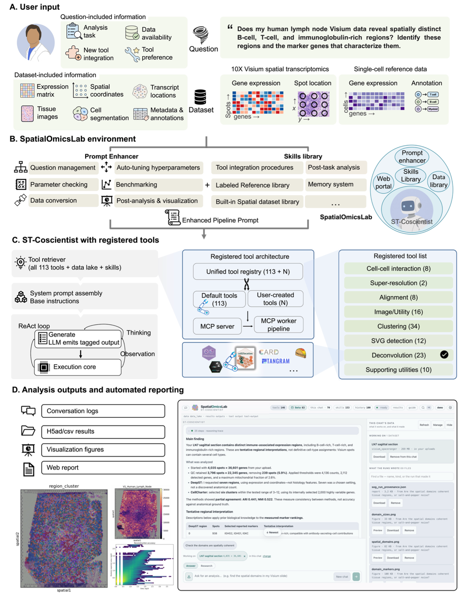

<!-- Lab logo: add an image to the repository (e.g. docs/img/logo.png) and uncomment the line below. -->
<!--  -->

# SpatialOmicsLab

SpatialOmicsLab: an integrated research environment for AI co-scientists in spatial transcriptomics

> [!NOTE]
> This repository contains the ST-Coscientist agent, its analysis tools and the setup installer. You use the agent
> from a terminal or from Python; there is no web portal.

Jiang, Y., Zhan, X., Quan, P., Wang, R., Wu, F., Mi, J., Yao, J., Yao, B., Xiao, G., Shi, W., & Xie, Y.

# Table of Contents

- [Introduction](#introduction)
- [Repository layout](#repository-layout)
- [Framework](#framework)
- [Citation](#citation)
- [Requirements](#requirements)
- [Installation](#installation)
- [Test installation](#test-installation)
- [Usage](#usage)
- [Analysis tools](#analysis-tools)
- [Configuration](#configuration)
- [Moving an install](#moving-an-install)
- [Development](#development)
- [Security](#security)
- [License](#license)
- [Contact us](#contact-us)

## Introduction

Spatial transcriptomics has hundreds of analysis methods, and most come with their own software stack: PyTorch for
one, R/Bioconductor for the next, a pinned CUDA build for a third. SpatialOmicsLab is a research platform built around
an LLM agent, **ST-Coscientist**, that takes this work off your hands. This repository packages the agent on its own. You describe an analysis in ordinary language
("find the spatial domains in this Visium slide", "deconvolve these spots against my single-cell reference"), and the
agent plans it, runs it and reports back.

The agent brings four main contributions:

1. **A ReAct agent for spatial omics.** ST-Coscientist retrieves the tools, datasets and curated know-how relevant to
   your task, writes and executes code, checks the output and decides the next step.
2. **A large tool platform.** 521 tools: 145 analysis functions served by 95 Model Context Protocol (MCP) servers,
   plus 376 in-process research tools (databases, expression atlases, pharmacology, literature).
3. **Conflict-free environments.** Each method that needs one runs in its own conda environment, so methods with
   incompatible dependencies coexist on one machine. A guided installer (`sog-setup`) builds and tests them.
4. **Two ways in.** A terminal chat (`stcoscientist`) and a Python API. The agent works with Anthropic, OpenAI,
   Azure OpenAI, Gemini, Groq, AWS Bedrock, Ollama and any OpenAI-compatible endpoint.

*SpatialOmicsLab* is the project, *ST-Coscientist* is the agent, and `spatialomicsgym` is the Python package.

## Repository layout

| Path | Contents |
|------|----------|
| [`agent/spatialomicsgym/`](agent/spatialomicsgym/) | The `spatialomicsgym` package: the ST-Coscientist agent, the terminal chat, the in-process research tools, know-how and report rendering |
| [`agent/tools/`](agent/tools/) | The MCP servers and the per-method workers they call |
| [`agent/MCP_server/`](agent/MCP_server/) | `mcp_config.yaml`, the list of MCP servers the agent can wire |
| [`agent/skills/`](agent/skills/) | The skill categories that group the MCP functions for tool routing |
| [`agent/tools_user/`](agent/tools_user/) | Helpers for tools the agent creates at run time |
| [`agent/benchmarks/`](agent/benchmarks/) | The benchmark harness and evaluator |
| [`install/`](install/) | The `sog-setup` installer (`sog_install`) and the conda recipes for each tool |

See [agent/README.md](agent/README.md) for more detail.

## Framework

<p align="center">
  
</p>

**(A)** The user poses a question in plain English and provides a dataset, such as 10x Visium spatial
transcriptomics with a single-cell reference. **(B)** The SpatialOmicsLab environment enriches the question with a
prompt enhancer (question management, parameter checking, data conversion, hyper-parameter tuning, benchmarking,
post-analysis) and a skills library (tool integration procedures, reference and spatial dataset libraries, memory).
**(C)** ST-Coscientist retrieves the relevant tools, assembles the system prompt and runs a ReAct loop over a unified
registry of default and user-created MCP tools. **(D)** Each analysis produces conversation logs, h5ad/csv results,
visualization figures and a web report.

## Citation

If you use SpatialOmicsLab in your research, please cite us:

Jiang, Y., Zhan, X., Quan, P., Wang, R., Wu, F., Mi, J., Yao, J., Yao, B., Xiao, G., Shi, W., & Xie, Y.
SpatialOmicsLab: an integrated research environment for AI co-scientists in spatial transcriptomics.

## Requirements

1. Linux or macOS
2. Python ≥ 3.11 - https://www.python.org
3. conda, mamba or micromamba - https://docs.conda.io (for the per-tool environments; chat without analysis tools
   works without it)
4. An API key for one LLM provider, or a local Ollama server - https://ollama.com

## Installation

1. Clone the repository:

   ```bash
   git clone https://github.com/jiangyi01/SpatialOmicsLab.git
   cd SpatialOmicsLab
   ```

2. Create the agent environment and install the package:

   ```bash
   conda env create -f agent/spatialomicsgym/spatialomicsgym_env/spatialomicsgym_env.yml
   conda activate spatialomicsgym_env
   pip install -e .
   ```

3. Run the guided installer. It configures your LLM provider (and checks the key), lets you choose skill
   categories, then builds and tests the tool environments. It is resumable: re-running it continues where it
   stopped.

   ```bash
   sog-setup
   ```

   When it finishes, it offers to start the terminal chat.

> [!NOTE]
> To set the provider by hand instead, copy `.env.example` to `.env` and fill in `SOG_SOURCE`, `SOG_LLM` and the
> key block for your provider. There is no PyPI package; to install without a clone, use
> `pip install "spatialomicsgym @ git+https://github.com/jiangyi01/SpatialOmicsLab.git"`.

## Test installation

```bash
sog-setup conncheck       # end-to-end wiring: base env <-> MCP servers <-> agent
sog-setup doctor          # per-tool environment health report
stcoscientist "Which tool detects spatial domains in Visium data?"
```

> [!IMPORTANT]
> The tool tests inside `sog-setup` use small datasets from a local `test/` tree that is not part of this
> repository. Without it, `sog-setup` falls back to an import check for each tool and says so.

## Usage

### Terminal chat

```bash
stcoscientist --mcp                                                   # interactive session; /help lists commands
stcoscientist "Which tool detects spatial domains in Visium data?"   # one-shot
stcoscientist -q "Summarize ./data/visium.h5ad" > answer.txt         # one-shot, answer only
sog-setup chat                                                        # start the chat in the env sog-setup built
```

Each analysis writes its conversation log, h5ad/csv results, figures and an HTML report (`report.html`) to disk.

### Python API

```python
from spatialomicsgym import clean_answer
from spatialomicsgym.agent import STCoscientist

agent = STCoscientist(path="./data")   # where datasets are read and written
agent.add_mcp()                        # wire the analysis tools

log, answer = agent.go("Identify spatial domains in my Visium slide and summarize each domain's marker genes.")
print(clean_answer(answer))
agent.save_conversation_history("analysis_report.pdf")
```

> [!IMPORTANT]
> `--mcp` (or `add_mcp()`) is what connects the analysis tools; without it the agent has none. A bare `--mcp` uses
> `$SOG_MCP_CONFIG`, which `sog-setup` records. Run `stcoscientist --help` or `sog-setup --help`
> for every option.

## Analysis tools

The MCP tools are grouped into skill categories ([`agent/skills/`](agent/skills/)).
[`agent/MCP_server/mcp_config.yaml`](agent/MCP_server/mcp_config.yaml) is the full list.

| Skill category | Representative tools |
|----------------|----------------------|
| Spatial clustering | GraphST, STAGATE, DeepST, SEDR, PRECAST, BASS, SpaceFlow, stLearn, CellCharter |
| Deconvolution | cell2location, RCTD, Tangram, CARD, DestVI, SPOTlight, CytoSPACE, TACCO, CellTrek |
| Spatially variable genes | SpatialDE, SOMDE, SPARK, BSP, SpaGFT, Hotspot, PROST |
| Cell segmentation | Cellpose, DeepCell, BIDCell, ClusterMap |
| Alignment and 3D | PASTE, PASTE2, CAST, STalign, GPSA, SPIRAL, SLAT, ST-GEARS |
| Cell-cell communication | COMMOT, NCEM, DeepLinc, MistyR, SpaOTsc |
| General spatial analysis | Squidpy, Seurat, SpatialPCA, SpatialGlue, moscot, iStar, pathway analysis, visualization |
| Data conversion | CSV ↔ h5ad, h5ad ↔ Seurat RDS |

With `SOG_TOOL_CREATION_ENABLED=true`, the agent can also build new tools from a method's repository. To contribute a
tool to the platform, see [agent/CONTRIBUTION.md](agent/CONTRIBUTION.md).

## Configuration

Settings are read from the environment and from `.env` (template: [`.env.example`](.env.example)). The most common:

Variable | Description | Default
-------- | ----------- | -------
`SOG_SOURCE` | LLM provider: `Anthropic`, `OpenAI`, `AzureOpenAI`, `Gemini`, `Groq`, `Bedrock`, `Ollama`, `Custom` |
`SOG_LLM` | Model or deployment name |
`SOG_DATA_PATH` | Agent data directory | `./data`
`SOG_TIMEOUT_SECONDS` | Maximum seconds per code-execution step | `600`
`SOG_MCP_CONFIG` | The MCP config a bare `--mcp` uses | set by `sog-setup`
`SOG_COMMERCIAL_MODE` | Exclude non-commercial datasets | `false`
`SOG_TOOL_CREATION_ENABLED` | Let the agent build new tools | `false`

Runtime state (wizard logs, setup progress, saved keys) lives in `.sog_setup/`: at the repository root in a clone,
or under `$SOG_HOME` (default `~/.spatialomicsgym`) for a pip install without a clone.

## Moving an install

To move a working install to another machine, including tools you created, run `sog-setup pack` on the source, then
`sog-setup unpack BUNDLE` on the destination. Keys never travel in the bundle.

## Development

```bash
pip install -e ".[dev]"
ruff check . && ruff format .
pre-commit install
```

## Security

The agent executes code that the LLM writes. Run it on a machine or container you are prepared to give it, and keep
credentials and sensitive data out of its reach. There is no web portal and so no privilege boundary: the code
runs as the user who started the agent. See [agent/SECURITY.md](agent/SECURITY.md).

## License

SpatialOmicsLab is released under the **GNU Affero General Public License v3.0 only** ([LICENSE](LICENSE)). If you
run a modified version as a network service, you must make its source available to its users. Third-party components
keep their own licenses ([THIRD_PARTY_LICENSES/](THIRD_PARTY_LICENSES/README.md)), and some integrated datasets are
non-commercial ([license_info.md](license_info.md)); review them before commercial use.

## Contact us

If you have any suggestions or ideas for SpatialOmicsLab, or are having issues trying to use it, please don't hesitate
to reach out to us through [GitHub Issues](https://github.com/jiangyi01/SpatialOmicsLab/issues).

<!-- Add maintainer names and emails here, e.g.:
Firstname Lastname, firstname[dot]lastname@institution[dot]edu
-->
